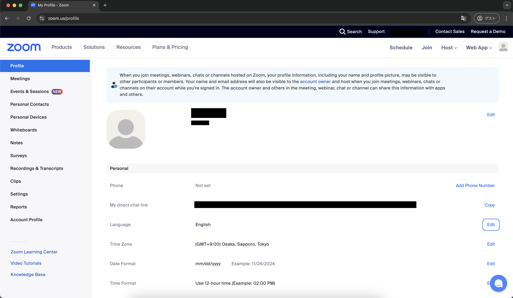
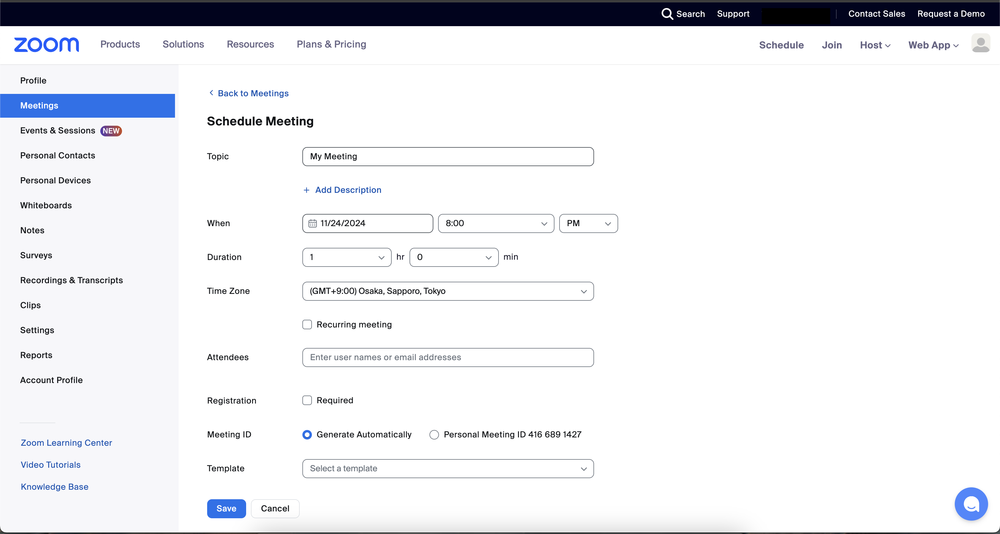
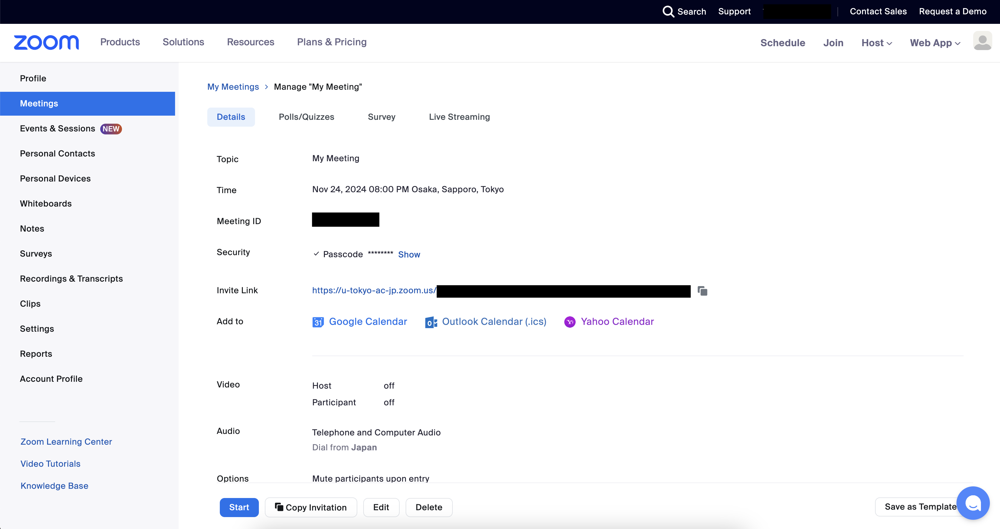
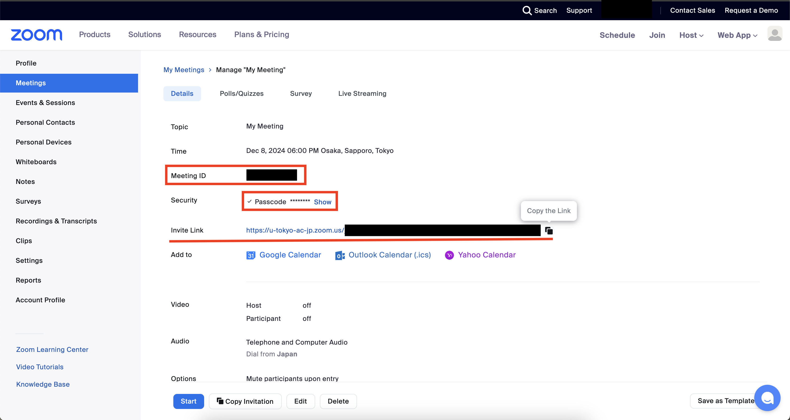
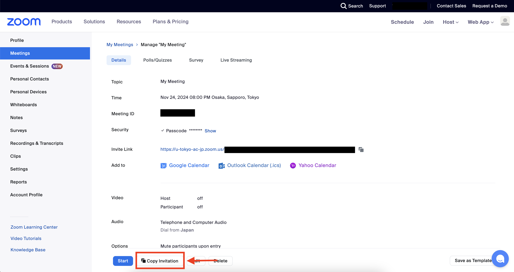

## Introduction
{:#introduction}
This page explains how to create a Zoom meeting in a web browser and provides an overview of the settings available when creating a meeting.
For information on creating Zoom meetings using the app, please refer to [Scheduling a Zoom Meeting (Zoom App)](/en/zoom/misc/app). Be sure to check it out as well.

## Scheduling Meetings
{:#steps-to-create}
This section introduces the procedures for creating a Zoom meeting using a web browser and sharing the information needed for participants to join the created meeting.

1. Access the [Zoom My Account page](https://u-tokyo-ac-jp.zoom.us/profile) from a web browser.
{:.border}
1. Select "Schedule" in the header of My Profile.
{:.border}  
1. On the displayed screen, please set the required fields. For detailed explanations of each setting, refer to the “[Zoom Meeting Options](#settings)" section below.
{:.border}
1. Once you click on the "Save" button, your Zoom meeting will be created.
{:.border}
1. The details of the meeting created will be displayed. Verify that it has been set up according to the settings you configured earlier.
{:.border}

Participants can join the Zoom meeting using either the "Invitation Link" or the "Meeting ID and Passcode".

There are two main ways to share the "Invitation Link" or "Meeting ID and Passcode" with participants.
* Copy the "Invitation Link" displayed on the meeting details screen and share it with the participants. Additionally, it is helpful to share the "Meeting ID" and "Passcode" along with the "Invitation Link".
{:.border}
* Select the "Copy Invitation" button displayed on the screen in Step 5 and share the content of the displayed screen with the participants. For simplicity and convenience, it is especially helpful to extract and share just the Invitation Link, Meeting ID, and Passcode.
{:.border}{:.border}

## Meeting Settings Items
{:#settings}
This section provides an overview of the settings for creating a meeting.

### General Meeting Settings
{:#settings-general}
#### Topic
{:#settings-topic}
Set the name of the meeting.

By clicking "Add Description", you can enter a detailed description of the topic. The information entered may be displayed alongside the topic as information for participants.

### Settings for the Meeting Date and Time
{:#settings-date_and_time}
For more details, please refer to "[Scheduling Recurring Zoom Meetings](/en/zoom/create_room/date_and_time)".

#### Date and Time of the Meeting

This allows you to set an estimated start time. It is only an estimate, and you can begin the meeting earlier than the set start time. The meeting will not automatically start once the set time has passed.

#### Duration

This field sets an estimated duration for the meeting. It can only be set in 15-minute intervals, but is just an estimate. The meeting will not automatically end once the set time has passed.

#### Time Zone

This field sets "the region for the meeting date and time".

#### Recurring Meeting

If you are holding recurring classes or meetings with the same topic and participants, creating a Zoom meeting each time can be time-consuming. It is also more convenient for participants to join from the same URL each time. In such cases, please place a check mark in the "Recurring Meeting" option.

### Other Various Settings
{:#settings-misc}
#### Registration
{:#settings-registration}
This feature is used when you want participants to register in advance with details such as their name and contact information. It can be useful for tracking participants for large events. For more details, please refer to "[Requesting Participant Registration in Zoom Meetings](/zoom/create_room/registration/) (in Japanese)".

#### Meeting ID
{:#settings-meetingid}
Generally, it is fine to leave the option set to "Generate Automatically".

When "Generate Automatically" is selected, a new meeting ID will be automatically generated and assigned to the meeting being created. On the other hand, if the "Personal Meeting ID" is selected, a unique number assigned to each user (the "Personal Meeting ID") will be used as the meeting ID.

#### Template
{:#settings-template}
This feature can be used if you have previously created meeting templates.

#### Whiteboard
{:#settings-whiteboard}
This is a virtual whiteboard feature that can be used during the meeting.

#### Security
{:#settings-security}
Zoom meeting IDs are typically 10-digit numbers, and without any security measures in place, there is a risk that someone who shouldn't have the ID could guess the numbers and join the meeting. To enhance security, please use these features.

For more details, refer to the page "[Restricting Access to Zoom Meeting Rooms for Online Classes](/en/faculty_members/zoom_access_control)." The article focuses on the settings recommended for use in classes, but the content is also applicable to general meetings and other events.

* Passcode
  * When enabled, participants will be required to enter a passcode in addition to the meeting ID when joining the meeting. It is very difficult to randomly guess both the passcode and the meeting ID, which significantly reduces the risk of unauthorized third parties joining the meeting. By default, this setting is enabled, so unless you have a specific reason, it is recommended to leave it on. You can either specify your own passcode or use an automatically generated one.
  * In the default settings, the invitation link for the meeting includes both the meeting ID and passcode information. Therefore, even if the passcode feature is enabled, participants only need to be provided with the invitation link, and there is no need to separately inform them of the passcode. However, there may be cases where it is useful to share both the meeting ID and passcode in addition to the invitation link (for more details, please refer to the notice “[how to announce online class URL](/en/faculty_members/url#use-online-class-info-in-general)”). If you do not want the passcode information to be embedded in the invitation link, it can be changed from the settings page. For more information, please refer to the "[How to Set Up Commonly Used Features](#popular_functions)" section below.
* Waiting Room
  * When enabled, participants will not be able to join the meeting directly until the host individually approves their entry, and they will remain in the waiting room. This feature is useful if you want to allow only approved participants to attend the meeting.
  * For more details, please refer to "[Setting up a Zoom Waiting Room](/en/zoom/create_room/waiting_room/)".
* Only Authenticated Users Can Join
  * This feature controls whether or not participants can join the meeting based on the type of account they use to sign in to Zoom.
  * When enabled and "Sign in with University Account" is selected, only users signed in to Zoom with a UTokyo Account can join the meeting.
  * When enabled and "Sign in to Zoom" is selected, only users signed in to Zoom, regardless of account type, can join the meeting.
  * For more details, please refer to “[Requiring Authentication to Join a Zoom Meeting](/en/zoom/create_room/auth/)”.

#### Video
{:#settings-video}
This setting controls whether participants will join the meeting with their camera on or off. It only affects the initial state when entering the meeting and does not affect the ability to turn the camera on or off during the meeting.

#### Audio
{:#settings-audio}
This setting controls the types of audio participants can use during the meeting. Zoom offers a method for joining by phone for audio-only participation, even without an internet connection. However, if "Computer Audio" is selected, this method will not be available. Generally, it is fine to leave the setting on "Both".

#### Options
{:#settings-options}
* Allow Participants to Join
  * This feature allows participants to enter the meeting before the host joins. You can change the number of minutes before the host opens the meeting that participants are allowed to enter from the settings page. For more details, please refer to the section below, "[How to Set Up Commonly Used Features](#popular_functions)".
* Q&A
  * This is a feature designed to make it easier to manage questions from participants.
* Mute Participants Upon Entry
  * This feature mutes participants when they join the meeting. It only controls whether or not participants are muted upon entry and does not affect their ability to switch their microphone on or off during the meeting.
* Pre-Assign Breakout Rooms
  * By using the breakout room feature, you can split participants from the main meeting room into multiple breakout rooms. This feature allows you to pre-assign participants to specific rooms in advance.
  * For more details, please refer to "[Zoom's Breakout Room Feature](/zoom/usage/breakout) (in Japanese)".
* Automatically Record the Meeting
  * This feature automatically starts recording as soon as the meeting begins. You can choose to save the recording either on your local computer (your PC) or on the cloud. Even if this option is turned off, you can manually start recording during the meeting.
  * For more details, please refer to “[Recording Zoom Meetings](/en/zoom/usage/recording/)”.
* Approve or Block Users from Specific Regions/Countries
  * This setting allows you to permit or deny participation from specific regions or countries. When enabled, you can select the regions or countries and specify whether to allow or block participation from those locations.
* Alternative Host
  * An "Alternative Host" is a user who can start the meeting on behalf of the host. You can designate an alternative host using this field.
  * However, only users with a UTokyo Account can be designated. To assign someone, enter their 10-digit common ID (UTokyo Account username) followed by the symbol `@utac.u-tokyo.ac.jp` (e.g., `0123456789@utac.u-tokyo.ac.jp`).
  * For more details, please refer to the section on "Alternative Host" in "[Host and Co-host Controls in a Zoom Meeting](/zoom/misc/management_roles/#alt_host)(in Japanese)".

