## What are the Polls in Zoom?

{:#about}
The polling feature in Zoom allows the meeting host and co-hosts to gather responses from their participants in various formats, such as single-choice, multiple-choice, and open-ended questions. In addition to regular polls, the host and co-hosts can conduct quizzes in which they can set correct answers for closed-ended questions.

Additionally, other interaction methods with participants include [the reaction feature (such as raised hand and emoji)](../reaction/) and [the chat function (in Japanese)](/src/pages/zoom/usage/chat/). Outside of Zoom, using [Google Forms](../articles/google-form/) is another option. Choose and utilize the appropriate method that best suits your purpose.

## Host a Poll (For Hosts and Co-Hosts)

{:#conduct}

### Enabling the polling feature

{:#enable}
To use the polling feature, you are required to enable it in advance.

1. Access [the Zoom web portal](https://u-tokyo-ac-jp.zoom.us) with a web browser and sign in with your UTokyo Account.

2. Select the “Settings” tab from the left-hand menu.
   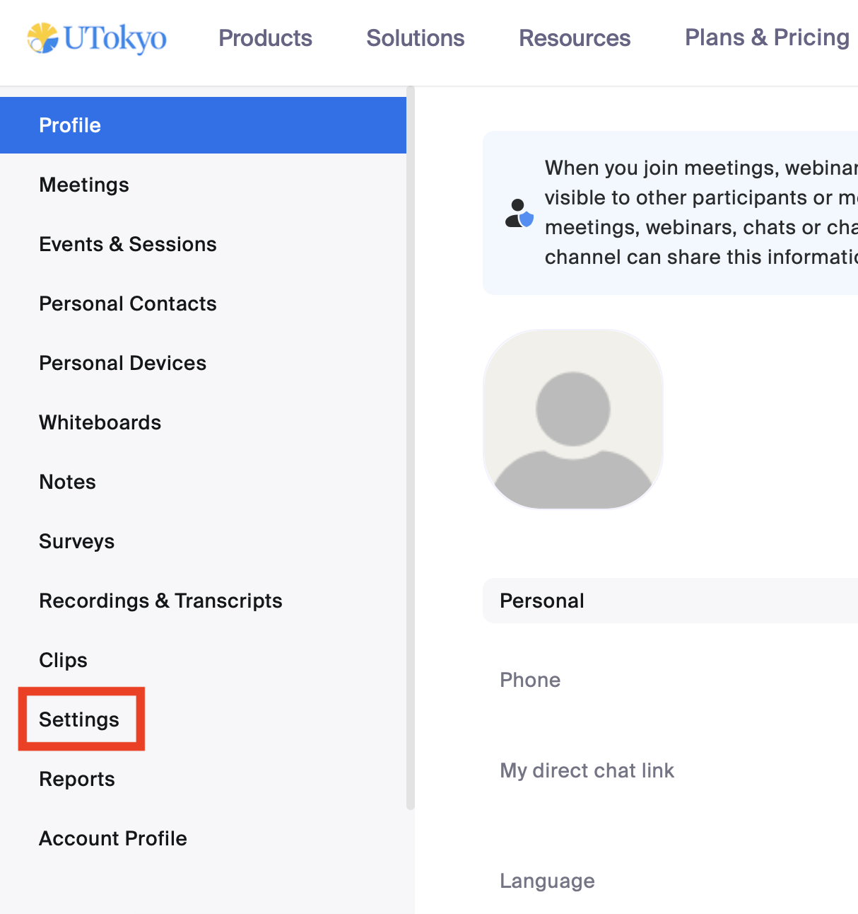{:.small .border}

3. Open the “Meeting” tab and press the “In Meeting (Basic)” button.
   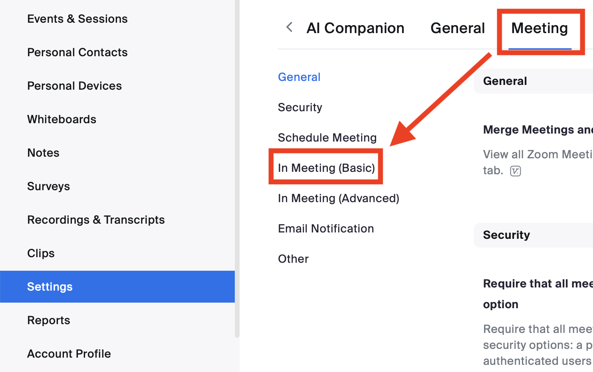{:.medium .border}

4. Scroll down the screen and turn on the “Meeting Polls/Quizzes” option.
   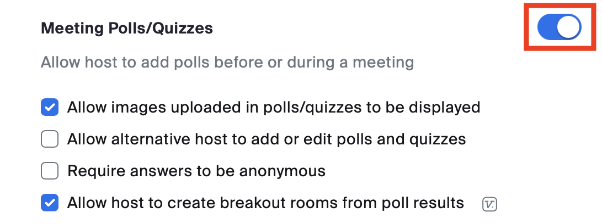{:.medium .border}

### Creating a Poll

{:#create}
Polls can be created either [before a meeting](#before_meeting) or [during a meeting](#during_meeting). The following explains the procedures for each case.

#### Creating a poll before a meeting

{:#before_meeting}

1. Access [the Zoom web portal](https://u-tokyo-ac-jp.zoom.us) with a web browser and sign in with your UTokyo Account.

2. Select the “Surveys” tab from the left-hand menu and press the “+ Create” button at the top right.
   {:.medium .border}

3. Select “Poll or quiz” and press the “Create” button.
   {:.small .border}

4. Enter the required information, such as the poll title and questions.
   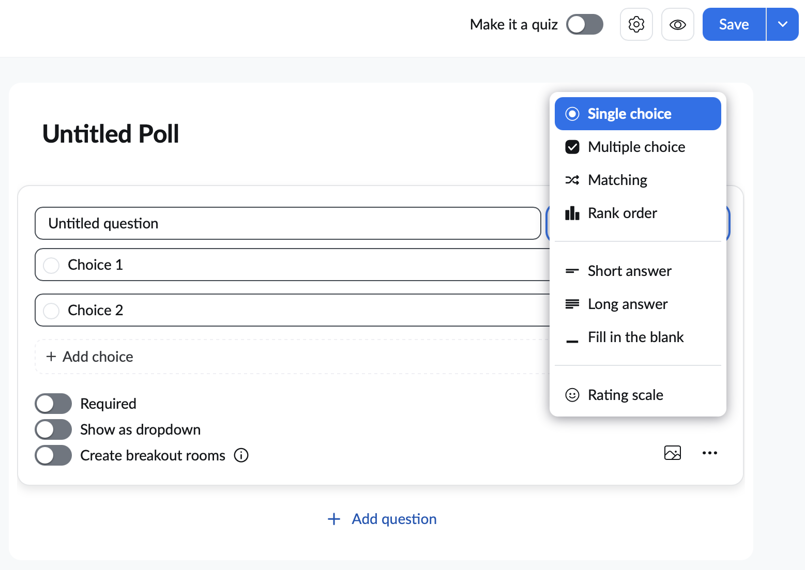{:.medium .border}

   - In addition to single-choice and multiple-choice questions, there are several other types of questions available, such as open-ended, fill-in-the-blank, and reordering questions.
   - When you want to set correct answers for closed-ended questions, turn on the “Make it a quiz” at the top right of the screen.
   - When you want to make the responses anonymous, check the “Require answers to be anonymous” option from the gear icon at the top right of the screen.

5. Press the “Save” button at the top right to save the poll.

#### Creating a poll during a meeting

{:#during_meeting}

1. Press the “More” button at the bottom of the Zoom screen, then select “Polls/quizzes”.
   {:.medium}

   - If the “Polls/quizzes” is displayed at the bottom of the Zoom screen, select it.
     {:.medium}

2. The following window will appear. Press the “+ Create” button.
   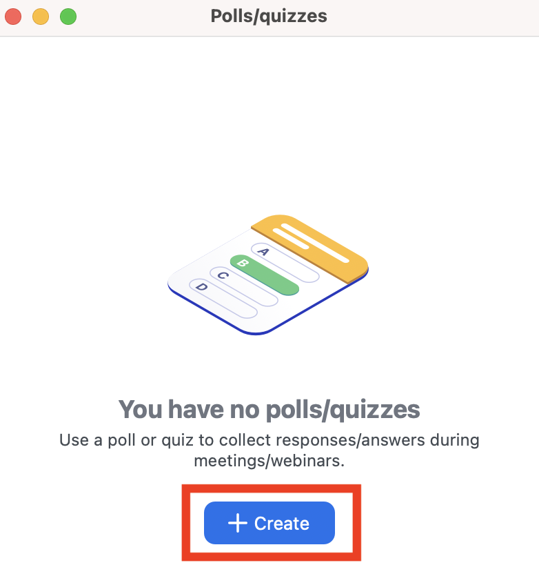{:.small .border}

3. Enter the required information, such as the poll title and questions.
   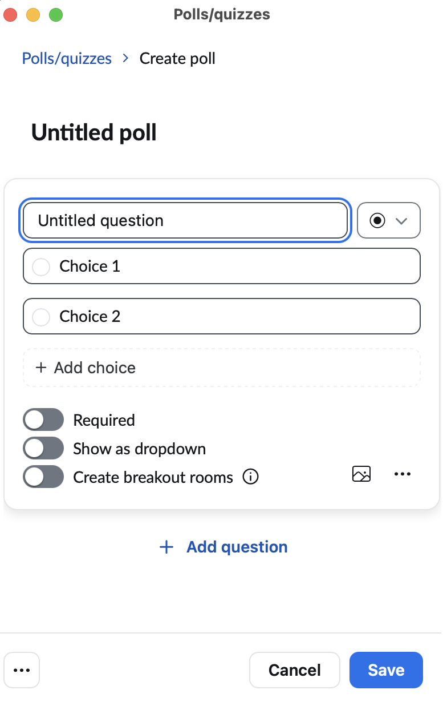{:.medium .border}

   - In addition to single-choice and multiple-choice questions, there are several other types of questions available, such as open-ended, fill-in-the-blank, and reordering questions.
   - When you want to make it a quiz or make the responses anonymous, change the settings through the “...” in the bottom left.

4. Press the “Save” button at the bottom right to save the poll.

### Launching a poll

{:#carry_out}

1. During the meeting, press the “More” button at the bottom of the Zoom screen and select “Polls/quizzes”.
   {:.medium}

   - If “Polls/quizzes” is displayed at the bottom of the Zoom screen, select it.
     {:.medium}

2. Hover the cursor over the poll you want to conduct, and the “Launch” button will appear. Press the “Launch” button to begin the poll.
   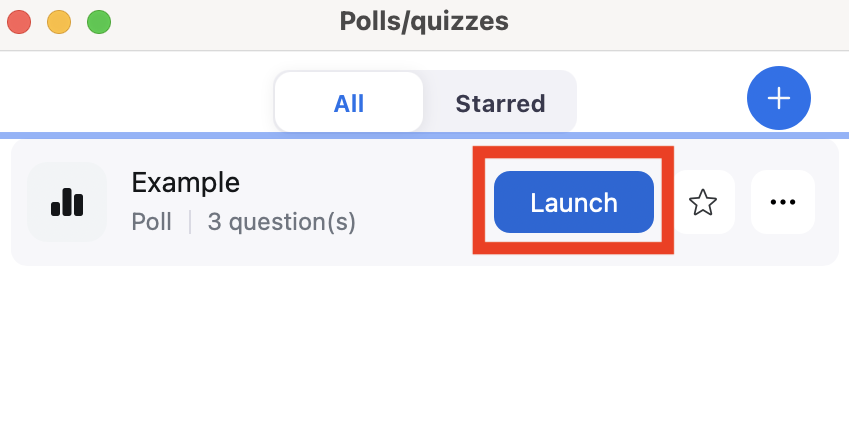{:.small .border}

   - During the poll, a screen will be displayed where you can check the elapsed time and the current poll results.
     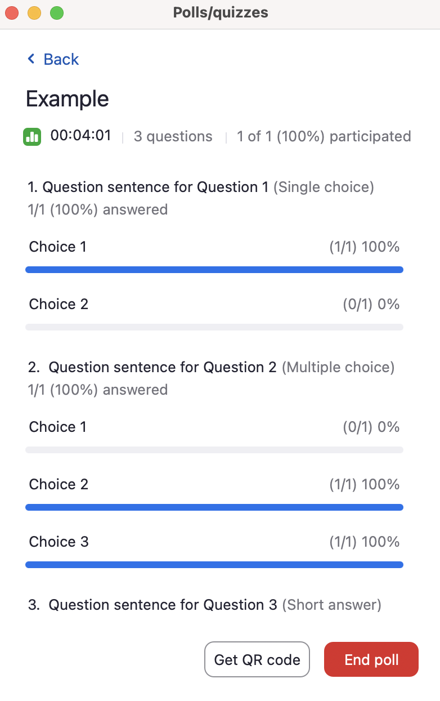{:.medium .border}

3. When participants have completed their responses, press the “End poll” button at the bottom right to close the poll.
   - After the poll ends, the final results will be displayed only to the host and co-hosts.
     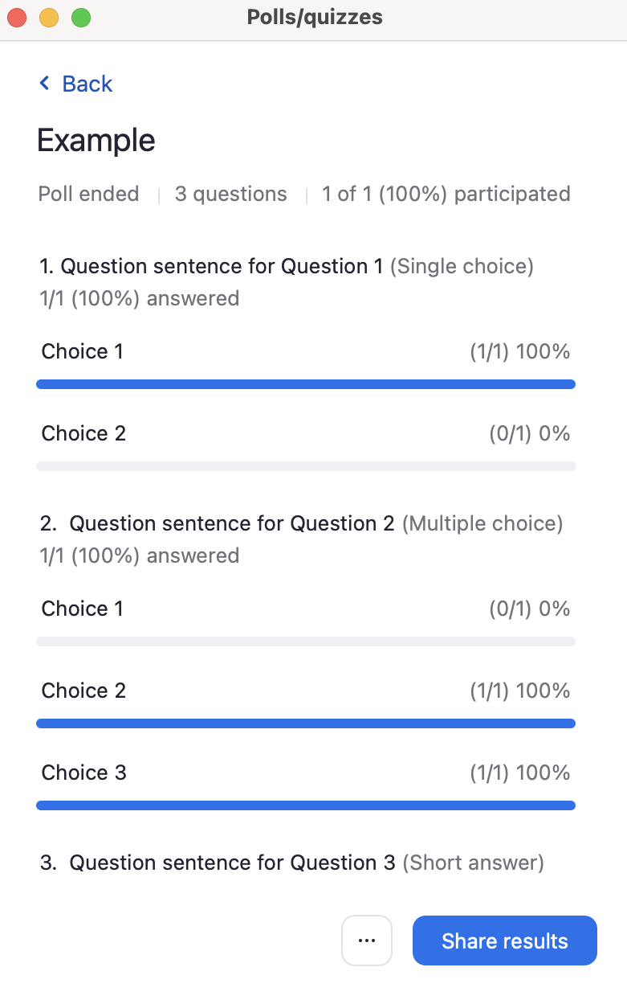{:.medium .border}
   - After pressing the “End poll” button, you can use the “Re-launch poll” feature. This feature allows you to begin a new poll using the same questions. Once you use this feature, however, you will no longer be able to review the results of any previous polls except the most recently started one.
   - You can share the poll results with participants immediately after the poll ends. To do so, press the “Share results” button at the bottom right of the screen that appears after the poll ends. Please note that a list of individual responses from other participants will not be displayed. Only the overall summary or each participant’s own responses will be shown. For closed-ended questions, only the percentage of respondents for each option will be shared. For open-ended questions, each participant will only see their own response, and responses from other participants will not be displayed. For details on how to share results during the meeting, refer to “View or share poll results during a meeting”.

### View or share poll results during a meeting

{:#share_during_meeting}
The following procedures allow you to view the results of polls that have already been conducted during a meeting and share the results with participants. Please note that a list of individual responses from other participants will not be displayed. Only the overall summary will be shared. For closed-ended questions, only the percentage of respondents for each option will be shared. Additionally, responses to open-ended questions will not be shared with others, and each participant will only see their own response on their screen.

1. During the meeting, press the “More” button at the bottom of the Zoom screen and select “Polls/quizzes”.
   {:.medium}

   - If “Polls/quizzes” is displayed at the bottom of the Zoom screen, select it.
     {:.medium}

2. Hover the cursor over the poll whose results you want to view or share, and the “View results” button will appear. Press the “View results” button.
   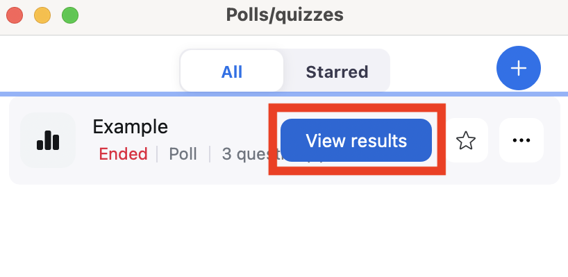{:.small .border}

3. A screen will appear where you can view the results. If you want to share them, press the “Share results” button at the bottom right.

   - When the results are shared, participants will see a screen like the second image.

       <figure class="gallery">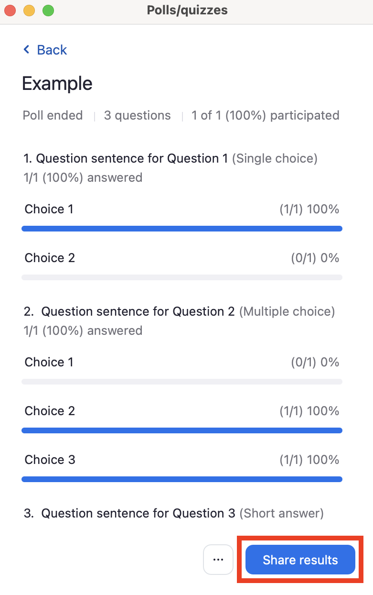{:.medium .border}{:.medium .border}</figure>

   - In the case of quizzes, you can share the correct answers. Check the “Show correct answers to all” option at the bottom left on the first image during the results sharing. Participants will see a screen like the second image.

       <figure class="gallery">{:.medium .border}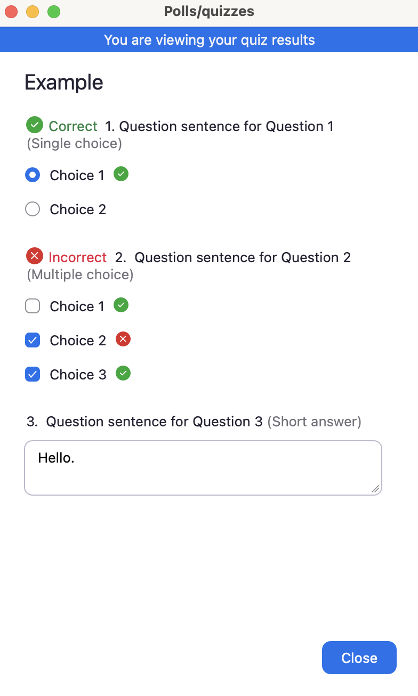{:.medium .border}</figure>

   - You cannot begin a new poll while the results are being shared.

4. To stop sharing the results, press the “Stop sharing” button at the bottom right.
   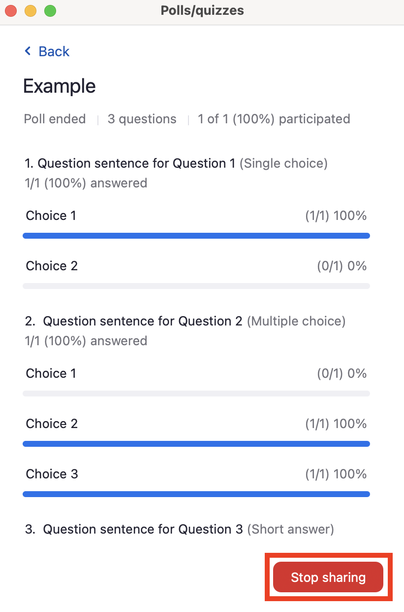{:.medium .border}
   - After stopping the sharing, the host and co-hosts can still view or share the results from the “Polls/quizzes” button until the meeting ends.

### Reviewing the poll results after the meeting

{:#view_after_meeting}
The person who created the meeting can review the poll results from the Zoom web portal even after the meeting has ended.

If you wish to [review the results of each individual poll](#check_per_poll), you can do so from the “Surveys” tab on the Zoom web portal. On the other hand, if you wish to [review the overall results of polls conducted during a meeting](#check_per_meeting), you can find them in the “Poll Report”, which can be downloaded from the “Reports” tab on the Zoom web portal.

#### Reviewing the results for each poll

{:#check_per_poll}

1. Access [the Zoom web portal](https://u-tokyo-ac-jp.zoom.us) with a web browser and sign in with your UTokyo Account.

2. Select the “Surveys” tab from the left-hand menu and find the poll for which you wish to review the results.
   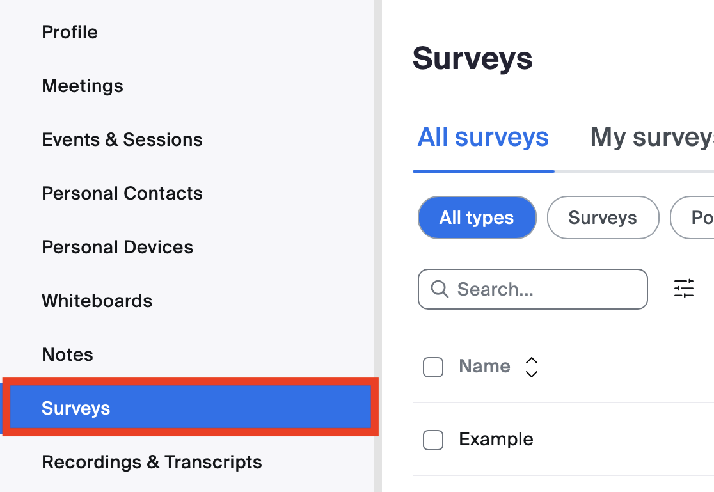{:.small .border}

3. Press the arrow button on the right side of the poll.
   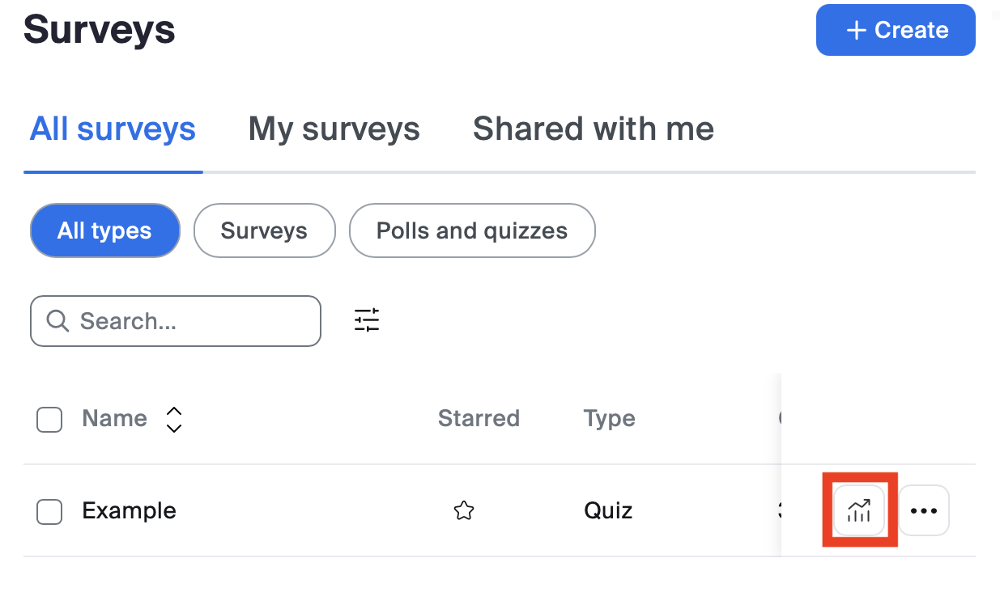{:.medium .border}

4. A screen will appear where you can check the typical time spent, the completion rate, and individual responses from each participant.
   - On this screen, you can also download the results in CSV format by pressing the downward arrow button at the top right.
     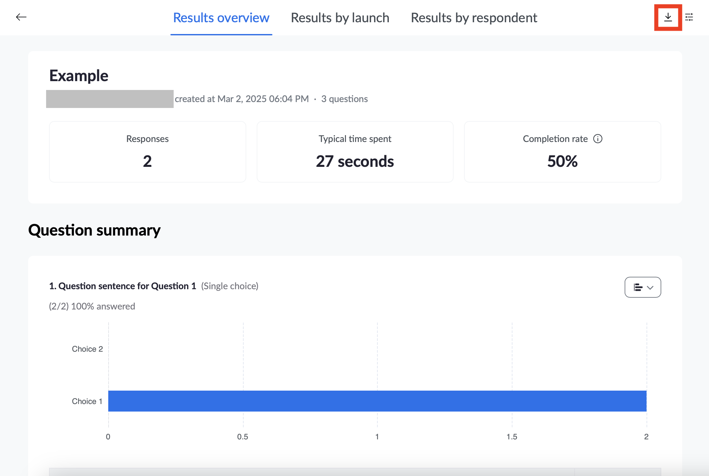{:.medium .border}

#### Reviewing the poll results for each meeting

{:#check_per_meeting}

1. Access [the Zoom web portal](https://u-tokyo-ac-jp.zoom.us) with a web browser and sign in with your UTokyo Account.

2. Select the “Reports” tab from the left-hand menu and press the “Meetings” button in the “Usage reports” page.
   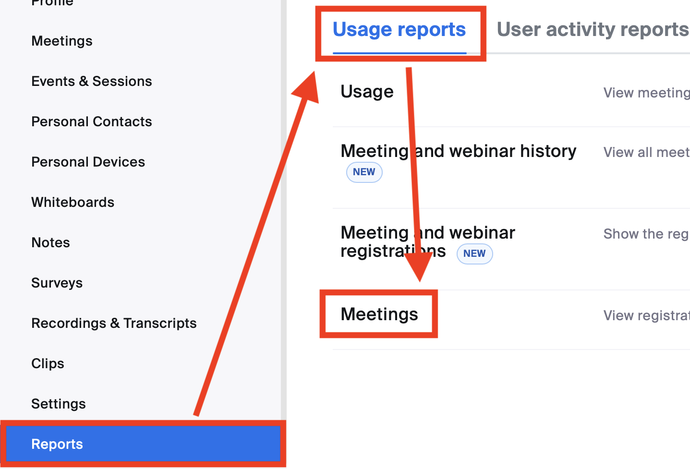{:.medium .border}

3. Set the date range to include the time when the meeting was held, select “Poll Report”, and press the “Search” button.
   {:.medium .border}

4. Press the “Generate” button on the right side of the meeting for which you wish to review the poll results.
   {:.medium .border}

5. The “Report queue” screen will be displayed. Once the poll report is generated, the “Download” button will appear. Press the button to download the poll results in CSV format.
   {:.medium .border}

## Participate in Polling （For Participants）

{:#join}

### Submit a poll response

{:#vote}

1. When the meeting host or co-hosts starts the poll, the following screen will appear. Answer the questions.
   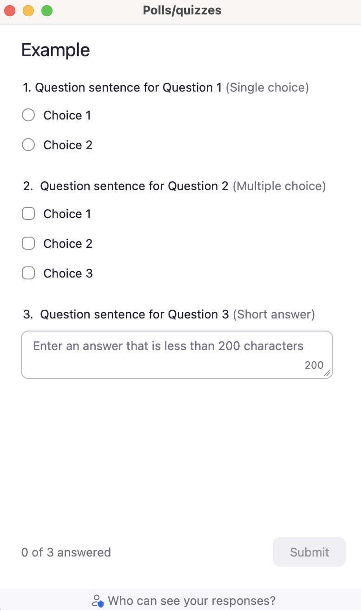{:.medium .border}

   - Press the “Who can see your responses?” button at the bottom of the screen to see an explanation of whether the responses are anonymous or not. If the host or co-hosts do not require responses to be anonymous, participants cannot respond anonymously. In this case, the username and email address of the participants will be shared with the host and co-hosts for each response.
   - After the poll ends, the host or co-hosts may share the responses with other participants.

2. Once you have completed your response, press the “Submit” button.
   - After submission, you cannot revise your response.

### Viewing the poll results shared by hosts

{:#view_shared_results}
When the host or co-hosts share the poll results after the poll ends, the following screen will be displayed.

On this screen, individual responses will not be shown, regardless of whether the poll was conducted anonymously or not. For closed-ended questions, only the percentage of respondents for each choice will be displayed. Open-ended questions will not be shared, and only your answers will be displayed.
{:.medium .border}
