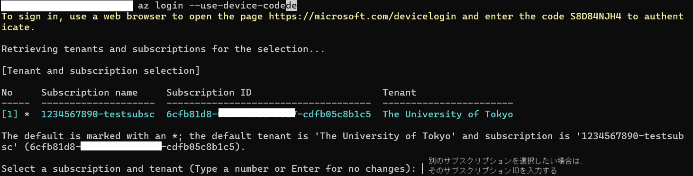
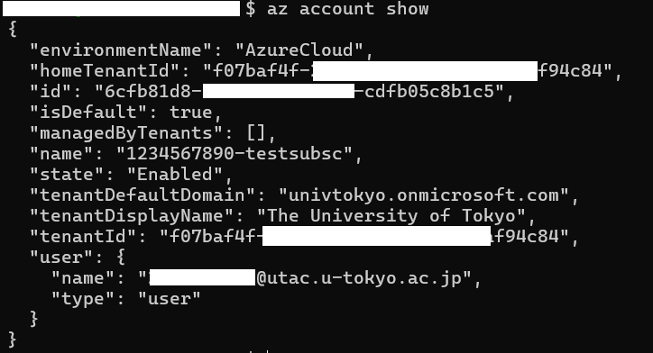

import HelpItem from "@components/utils/HelpItem.astro";

## 概要

Microsoft Azure には、リソースへのアクセスや操作をターミナルコマンドラインから行うことができる Azure CLI が用意されています．Azure CLI によってさまざまな操作をコマンドラインから行うことが可能ですが，UTokyo Azure では特にリモートから比較的セキュアにVMやその他リソースへのCLIアクセスを行うツールの１つとして紹介いたします．

## インストール

1. Azure CLI は，さまざまなOSプラットフォームでパッケージマネージャーから容易にインストールすることができるようになっています．以下のリンクからご自身の環境にあう方法でインストールしてください．

　※ 以下のリンクはいずれも Microsoft Learn のドキュメントへの外部リンクです．

- [Windows Powershell](https://learn.microsoft.com/ja-jp/cli/azure/install-azure-cli-windows?pivots=winget)
- [Mac OS](https://learn.microsoft.com/ja-jp/cli/azure/install-azure-cli-macos)
- [Debian 系 Linux(ubuntu等)](https://learn.microsoft.com/ja-jp/cli/azure/install-azure-cli-linux?pivots=apt)
- [Redhat 系 Linux(CentOS等)](https://learn.microsoft.com/ja-jp/cli/azure/install-azure-cli-linux?pivots=dnf)
- [その他のプラットフォーム等](https://learn.microsoft.com/ja-jp/cli/azure/install-azure-cli)

2. "az" というコマンドが使えるようになりますので，バージョン情報を出力してみて以下のような出力が得られたらインストール完了です．

```
$ az version
{
  "azure-cli": "2.71.0",
  "azure-cli-core": "2.71.0",
  "azure-cli-telemetry": "1.1.0",
  "extensions": {
    "ssh": "2.0.6"
  }
}
```

## ログイン

UTokyo Azure サービスで利用するためには，あらかじめ UTokyo Account で事前にログインした状態にしておく必要があります．以下に都度ログインをする方法と，環境変数を設定して常に自動的にログイン状態を保つ方法の２つを例示します．

### 通常のログイン方法

利用の度にブラウザによる認証をクリアする必要がありますが，一時的に利用する場合などはこちらの手順で問題ありません．

1. `az login`を実行する．
2. UTokyo Account のログイン画面がポップアップするので，UTokyo Azure で利用しているアカウントを選択する．
3. ログインに成功すると，紐づいているサブスクリプション名やID，テナント名の確認用出力がされるので，そのままでよければそのままエンターキーを押下し，別のサブスクリプションを操作したい場合は

{:.medium.center.border}

4. `az account show`コマンドを実行し，選択したサブスクリプションの情報が出力されればログイン成功．

{:.medium.center.border}

- もし選択したサブスクリプションが間違っていたら，以下のコマンドで変更が可能．
`az account set -s <サブスクリプション名かID>`

### ブラウザ認証を行わずログインする方法

az login --service-principal --username <sp_id> --password <sp_secret> --tenant <tenant_id>

