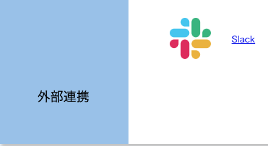
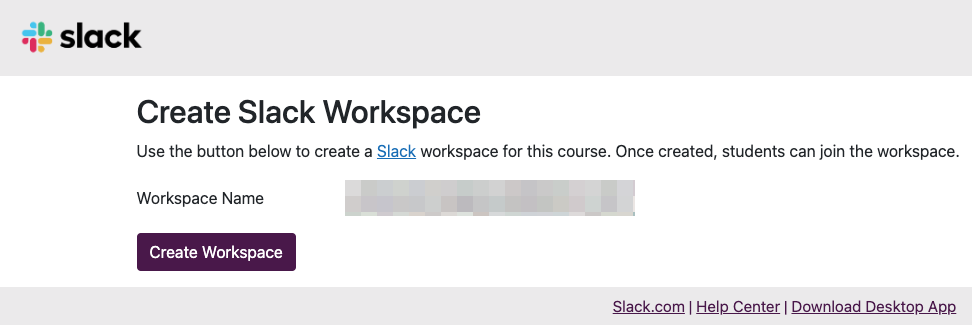
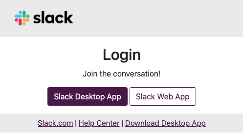

## 概要

UTOL の Slack 連携機能を用いると，UTOL 上のコースの担当教員や履修者などをメンバーとする専用の UTokyo Slack ワークスペースを運用可能となります．授業に関する学生からの質問対応や，担当教員・TA 同士の連絡などにご利用下さい．

## 特徴

* UTOL のコースに登録されたコース参加者(担当教員・TA・履修者)が，連携したワークスペースのメンバーとして自動的に登録されます．従って，履修する学生が多い授業で Slack 連携機能を使えば，ワークスペースのメンバー管理の手間を削減できます．  
* コースの開講期間の終了と共に，連携したワークスペースはアーカイブ化されます．  
* 同じワークスペースを他の授業(コース)で利用することはできません．例えば，翌年度に同じ内容の授業を開講する場合でも，翌年度に当該授業用に作成されたコースと連携する新たなワークスペースを作成することになります．

## 準備

1. UTokyo Slack を利用したことが無い場合は，UTokyo Slack ([https://utelecon.adm.u-tokyo.ac.jp/slack/](https://utelecon.adm.u-tokyo.ac.jp/slack/)) を読み，必要な設定を行って利用を開始してください．  
2. UTokyo Slackにおけるワークスペースの作成と運用 ([https://utelecon.adm.u-tokyo.ac.jp/slack/workspace/](https://utelecon.adm.u-tokyo.ac.jp/slack/workspace/) ) を読み，ワークスペースの運用方法や運用における注意事項などをご確認下さい．  
   * Slack 連携機能によるワークスペースは，UTOL 経由で作成します．通常の UTokyo Slack の「新規ワークスペース作成申請」を行う必要はありません．  
3. [\[UTOL\] Slack 連携機能利用申請フォーム](https://forms.office.com/r/95dTmqB3ui)で，必要事項を入力して Slack 連携機能の利用を申し込んでください．  
   * 申し込みはコースごとに必要です．  
   * 設定完了後，UTOL担当がメールでご連絡します．他の業務の都合によって数日を要する場合がありますが，ご了承ください．  
4. 利用するコースのコーストップ画面で，左メニューの「コース設定」\>「LTI利用設定」を選択してください．  
5. 表の左側にある「利用する」のチェックボックスのうち，「Slack」にチェックを入れてください．  
6. 「確認画面に進む」\>「登録する」ボタンをクリックしてください．コースで，UTokyo Slack をLTI連携で利用可能となります．  
7. コーストップ画面に戻ったら「外部連携」の欄にある「Slack」をクリックして下さい．

    

8. "Create Slack Workspace" の画面に遷移したら「Create Workspace」ボタンを押してください．Slack ワークスペースが作成され，自分自身はオーナー権限のメンバーとして登録されます．

    

## 利用

* コーストップ画面の「外部連携」の欄にある「Slack」をクリックして下さい．  
* 下記の画面が現れたら，Slack アプリもしくはウェブブラウザから Slack を利用してください．

## 補足・注意事項

* ワークスペースを作成したユーザが「ワークスペースのオーナー」になります．  
* 他のコース参加者は，毎時1回実行される同期処理で，もしくは外部連携の Slack をクリックしたタイミングで，当該コース専用のワークスペースのメンバーとして追加されます．  
* オーナー以外のコース参加者は，すべて「通常メンバー」として登録されます．他の担当教員などにワークスペースの設定などを任せたい場合は，その方々のアカウント種別を「ワークスペースの管理者」に変更してください．  
* コース参加者が UTokyo Slack を利用したことが無い場合は，UTokyo Slack ([https://utelecon.adm.u-tokyo.ac.jp/slack/](https://utelecon.adm.u-tokyo.ac.jp/slack/)) を読んで，適宜必要な設定を行うように案内してください．  
* **コースの開講期間が終了して30日経過すると，ワークスペースは自動的にアーカイブ化されます**．学生との議論などを後日参照したい場合は，Slack の「データのエクスポート」をご利用下さい．具体的な方法については [ワークスペースのデータをエクスポートする | Slack](https://slack.com/intl/ja-jp/help/articles/201658943-%E3%83%AF%E3%83%BC%E3%82%AF%E3%82%B9%E3%83%9A%E3%83%BC%E3%82%B9%E3%81%AE%E3%83%87%E3%83%BC%E3%82%BF%E3%82%92%E3%82%A8%E3%82%AF%E3%82%B9%E3%83%9D%E3%83%BC%E3%83%88%E3%81%99%E3%82%8B) などをご覧ください．
* ワークスペースのメンバーには，コース参加者のほか「UTokyo Slack Primary Owner (アカウント種別: プライマリーワークスペースオーナー)」という特別なユーザが登録されています．UTokyo Slack Primary Owner を削除することはできません．
