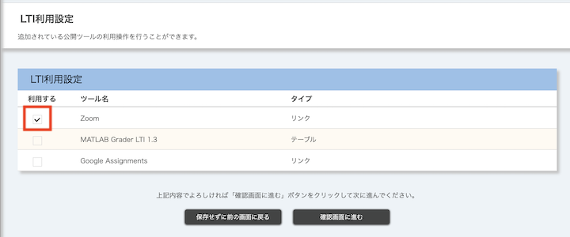

## 概要

LTI連携機能により，UTOLとZoomミーティングを連携させて利用することができます．LTI連携機能を利用すると，以下のような利点があります．

- コース参加者が，オンライン授業のURLなどを確認することなく，UTOLの画面上での操作のみで，Zoomミーティングに参加できるようになります．
- コース内に登録されている他の担当教員やTAが，Zoomミーティングの「代替ホスト」として自動的に登録されます．
- ミーティングをクラウドレコーディング（クラウド記録）した場合，録画URLの公開などをしなくても，その録画をコース参加者が閲覧できるようになります．

なお東京大学では，オンライン授業のURLを連絡するには，原則としてUTOLの「オンライン授業情報」欄を利用することになっています．詳しくは「[授業URLの連絡方法（教員向け）](/faculty_members/url)」のページをご覧ください．

## ミーティングを準備・実施する

### 事前準備

1. 「[UTOL Zoom LTI連携の利用申込フォーム](https://forms.gle/GY1GsxkoTDdUeSCKA)」より，LTI連携機能の利用を申し込んでください．
   - 申し込みはコースごとに必要です．
   - 設定完了後，UTOL担当がメールでご連絡します．他の業務の都合によって**数日を要する場合**がありますが，ご了承ください．
2. 利用するコースのコーストップ画面で，左メニューの「コース設定」>「LTI利用設定」を選択してください．
   {:.small}
3. 表の左側にある「利用する」のチェックボックスのうち，「Zoom」にチェックを入れてください．
   
4. 「確認画面に進む」>「登録する」ボタンをクリックしてください．コースで，ZoomをLTI連携で利用可能となります．

### ミーティングを作成する

1. コーストップ画面に戻ったら「外部連携」の欄にある「Zoom」をクリックして下さい．
   {:.small}
2. Zoomの画面の右上にある「新しいミーティングをスケジュールする」ボタンをクリックしてください．
   
3. ミーティングの設定画面が表示されます．必要に応じて設定を行ってください．
   - 設定する内容は[通常のZoomミーティング](/zoom/create_room/#settings-general)と同様です．
4. ページ下部の「保存」ボタンをクリックしてください．
   

### ミーティングを開始する

1. コーストップ画面の「外部連携」の欄にある「Zoom」をクリックして下さい．
   {:.small}
2. 表示されているミーティングの「開始」ボタンをクリックして下さい．Zoomのアプリケーションが起動します．
   

## 過去のミーティングを確認する

### ミーティングのレポートを確認する

1. Zoomミーティングの「前回のミーティング」タブを選択すると，過去にこのコースで利用したミーティングが表示されます．
   
2. 各ミーティングの「レポート」をクリックすると，ミーティングの参加者を確認できます．
   

### クラウド記録を閲覧する

1. コーストップ画面を開いてください．
2. 「外部連携」の欄にある「Zoom」をクリックして下さい．
   {:.small}
3. 「クラウド記録」のタブを選択してください．
4. 閲覧したいミーティングのタイトルをクリックしてください．
   
5. 閲覧したい録画上のボタンをクリックしてください．
   

## 補足・注意事項

- UTOLとZoom間のLTI連携機能を利用した場合，Zoomミーティングの招待リンク等を事前に示さなくても，履修者はミーティングに参加できるようになります．しかしながら，Zoomミーティングの招待リンク等を示さない場合，**Zoomミーティングの実施時にUTOLにログインできないと，ミーティングに参加することができません**．
  - UTOLにアクセスしづらくなったときでも授業に問題なく参加できるよう，Zoomミーティングの招待リンク等を「オンライン授業情報」にも書いた上で，UTOLにログインできない場合は，[東京大学オンライン講義検索システム（UTAS Lite2）](https://utelecon-directory.adm.u-tokyo.ac.jp/ja/login/?next=/ja/)を確認するよう伝えるのが良いでしょう．
- ミーティングを**クラウドレコーディング（クラウド記録）した場合，履修者を含むコース参加者は，自動的にその録画を閲覧できるようになります**．履修者等に録画を公開したくない場合には，ローカルパソコン上に録画を保存する設定にするか，LTI連携機能を利用せずにミーティングを実施してください．
- コース内に担当教員が複数登録されていたり，TAが登録されていたりする場合，他の担当教員やTAは，作成した担当教員がホストのZoomミーティングの「代替ホスト」として自動的に登録されます．
  - 但し，他の担当教員がミーティング作成後に初めて「次回のミーティング」にアクセスした際には，履修者と同様に「参加」ボタンが表示されることがあります．

## 参考ページ

- [LTI連携機能でUTOLからのZoomミーティングを利用する（学生向け）](../../../students/lti/zoom/)
- [授業URLの連絡方法（教員向け）](/faculty_members/url)
  - 教員から学生にオンライン授業のURL（Zoomなどの会議室のURL）を連絡する方法です．
- [東京大学における情報システムの準備について（教員向け）](/faculty_members/)
  - 主に教育活動に利用する情報システムの使い方を紹介しています．
  - ページの中程の「[授業URLの連絡](/faculty_members/#course-url)」と「[Zoomを使う](/faculty_members/#zoom)」もご覧ください．
