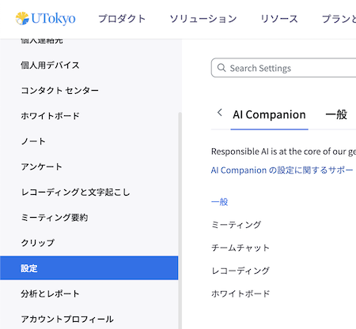

## AI Companionの概要

[東京大学のZoomアカウント](../)では，ミーティングの要約などをAIにより生成する機能である"Zoom AI Companion"を利用できます．

### 機能

AI Companionの主な機能としては，以下のようなものがあります．

- Zoom Meetingsで利用する機能
  - [ミーティング内質問](https://support.zoom.com/hc/en/article?id=zm_kb&sysparm_article=KB0057748): これまでのミーティングの内容について，ミーティングの参加者がAIに質問できる機能です．
  - [ミーティング要約](https://support.zoom.com/hc/en/article?id=zm_kb&sysparm_article=KB0058013): ミーティングで話し合われた内容の要約と次のステップを，AIがミーティング後に生成する機能です．
  - [スマート レコーディング](https://support.zoom.com/hc/ja/article?id=zm_kb&sysparm_article=KB0061102): AIがクラウドレコーディングしたミーティングの録画について，チャプターに分割したりハイライトを生成したりすることで，特に長時間のミーティングにおける録画を見やすくできる機能です．
- その他
  - ホワイトボードやZoom Docsでのコンテンツの生成などがあります．

ここで紹介しているのは一部機能です．AI Companionの各機能について，詳しくは「[Getting started with Zoom AI Companion features \> Current Zoom AI Companion features](https://support.zoom.com/hc/en/article?id=zm_kb&sysparm_article=KB0057623#h_01H9H14D223ZZYMH87XJ865WEE)」を参照してください．

## 生成AIの利用についての注意事項

まず，生成AIの利用についての一般的な注意事項については，以下を参照してください．

- [東京大学における生成AI利用に係るセキュリティガイドライン（2024年3月12日）</small>](https://univtokyo.sharepoint.com/sites/Security/SitePages/ai_use_security_guideline.aspx)<small>※閲覧にはUTokyo Accountでのサインインが必要です</small>
- **[生成系AI(ChatGPT, BingAI, Bard, Midjourney, Stable Diffusion等)について（2023年4月3日）](/docs/20230403-generative-ai)**
- [東京大学の学生の皆さんへ：AIツールの授業における利用について（2023年5月26日付／2023年5月29日掲載）](/docs/ai-tools-in-classes-students)
- [AIツールの授業における利用について（2023年4月28日付／2023年5月16日掲載）](/docs/ai-tools-in-classes)

特に，取り扱いに注意を要する情報（試験やレポートの問題，業務で知り得た機密情報，発表・公開すべきでない研究内容，その他関係者以外が知りえない情報）を入力しての利用は避けてください．[Zoom社の公式サポートページ](https://support.zoom.com/hc/ja/article?id=zm_kb&sysparm_article=KB0057861)によれば，Zoomで利用した情報やZoomで送信した情報は，生成AIモデルの学習に利用されることはないとされていますが，Zoom社やAI Companionで利用されているサードパーティ製モデルの提供者への送信自体は行われていることに注意する必要があります．

また，生成AIを利用してはいけない場面や，利用の条件が決まっている場面もあります．特に**授業においては，生成AIの利用の可否について，授業の特性に応じて担当教員が判断する**ことになっています．所属学科や専攻および各授業の担当教員の**指示に従い，認められていない場合には利用しない**でください．論文誌への投稿についても，生成AIの利用が禁止されている場合や，制限・条件が付けられている場合があるため，よく確認するようにしてください．

加えて，生成AIの出力には，事実ではない内容（ハルシネーション）や著作権など法的なリスクを伴う内容が含まれている可能性があります．生成AIの出力を利用した結果についての責任は，あくまでも利用者の側にあることを認識し，十分に注意して利用してください．

### データ利用・プライバシー保護に関する参考ページ

- [How Zoom AI Companion features handle your data](https://support.zoom.com/hc/ja/article?id=zm_kb&sysparm_article=KB0057861)
- [AI Companion のセキュリティとプライバシーに関するホワイト ペーパーのダウンロードページ](https://www.zoom.com/en/lp/zoom-ai-whitepaper/)(※英語のみ・ホワイト ペーパーのダウンロードには個人情報の入力が必要です)

## 利用方法

### 機能の有効化・設定

AI Companionの機能を利用するには，ミーティング前に利用したい機能を予め有効化する必要があります．

1. 「[Zoom ブラウザからサインインする方法](../signin/#browser)」の手順でZoomにサインインしてください．
2. 「設定」タブを開いてください．
3. 「AI Companion」タブを開いてください．
   
4. 使用したい機能に応じて，有効化・設定してください．
   - 一部の機能は，「管理者によりロック済み」と表示され，設定を変更できなくなっています．
   - 各機能の設定の詳細に関しては，「[Settings and Configuration for Zoom AI Companion](https://support.zoom.com/hc/en/category?id=kb_category&kb_category=891c5079c3bdf1104b490e8dc00131da)」に記載の各ページにある"User"に関する項目を参照してください．

### 各機能の利用方法

AI Companionの各機能の利用方法については「[Zoom AI Companion Features](https://support.zoom.com/hc/en/category?id=kb_category&kb_category=c61c9839c3bdf1104b490e8dc00131cd)」を参照してください．

## 参考情報

- [生成AI（ChatGPT等）関連情報](/online/topics/generative-ai)
- [Zoom AI Companion Support](https://support.zoom.com/hc/en/category?id=kb_category&kb_category=eabaef58c3b139904b490e8dc0013111)
- [Getting started with Zoom AI Companion features](https://support.zoom.com/hc/en/article?id=zm_kb&sysparm_article=KB0057623)
  - なお東京大学のZoomアカウントは，[米国の法律に基づく高等教育機関や医療機関に向けたBAA(Business Associate Agreement)](https://support.zoom.com/hc/en/article?id=zm_kb&sysparm_article=KB0067751)が適用されているアカウントに対するAI Companionの機能制限の対象とはなっていません．
