## はじめに
{:#overview}   
このページでは，Zoomのアプリに関して，基本的な使い方や便利な機能を紹介します．Zoomは，アプリではなくブラウザからでも利用できますが，ブラウザで使う場合は機能や使い勝手の面で制約があるため，アプリを利用することでZoomをより快適に使えます．本記事ではまず，PC用のデスクトップアプリのインストール方法や，ミーティングの作成・編集など基本的な操作について説明します．次に，スマートフォンなどのモバイル端末用のアプリについて簡潔に説明し，最後に，複数の端末間で参加中のミーティングを切り替える方法についても紹介します．

## PC用アプリのインストール方法
{:#install}  
アプリを利用するにはインストールする必要があります．
Zoomのアプリのインストールには，アプリを事前にインストールしておく方法と，ミーティングに参加するタイミングでインストールする方法の，2通りの方法があります．

### 事前にインストールする
{:#install-before}  
1. Zoomの「[ダウンロードセンター](https://zoom.us/download)」にアクセスしてください．
2. 「Zoom Workplace」の「ダウンロード」ボタンを押してください．Zoom Workplaceのインストーラーがダウンロードされます．  
※「Zoom Workplace」とは，Zoomを利用するためのアプリの名称です．
{:.border .medium}
{:.border .medium}
3. 以後の手順は場合によって異なります．インストールの完了まで自動で進むこともあれば，確認ボタンを押したり，ダウンロードしたファイルを自分で開いたりといった操作の必要があるかもしれません．
  
### ミーティングに参加するタイミングでインストールする
{:#install-on-join}  
1. ミーティングの URL にアクセスしてください．
2. Zoomのアプリがインストールされていない場合は，自動的に必要なファイルがダウンロードされるか，ダウンロードされない場合は以下のような画面が表示され，「今すぐダウンロードする」を押すと必要なファイルをダウンロードできます．
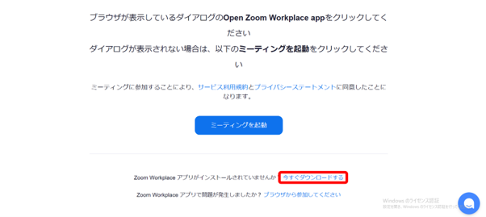{:.border}
3. ダウンロードしたファイルを開いて，Zoomをインストールしてください．

### UTokyo Accountでサインインする
{:#signin}  
Zoomのアプリがインストールできたら，「[Zoom サインイン方法](/zoom/signin/#app)」を参考に，UTokyo Accountでサインインしてください．

## アプリでのミーティングの作り方
{:#create}  
ミーティングを開催する際，アプリでミーティングを作成すると便利です．ここでは，アプリで，事前にミーティングを作成する方法と，すぐにミーティングを開始する方法を説明します．ただし，アプリからミーティングを作成する場合，一部の設定（ホワイトボード機能やブレークアウトルームの事前割り当てなど）が利用できないため，詳細な設定を行いたい場合は「[Zoom ミーティングを作成する](/zoom/create_room/)」で説明されている方法で，ブラウザから作成してください．

### 事前にミーティングを作成する
{:#create-schedule}  
ミーティングの開催日時が決定している場合に，事前にミーティングを作成しておくことができます．

1. Zoomのアプリを開いてください．
2. 「スケジュール」を押してください．
   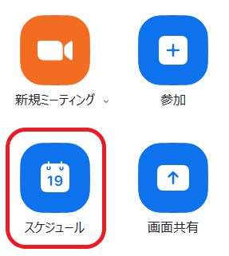{:.border .medium}
3. ミーティングの情報を設定してください．ミーティングの設定項目の詳細については「[ミーティングを作成する](/zoom/create_room/#settings)」のページで紹介しています．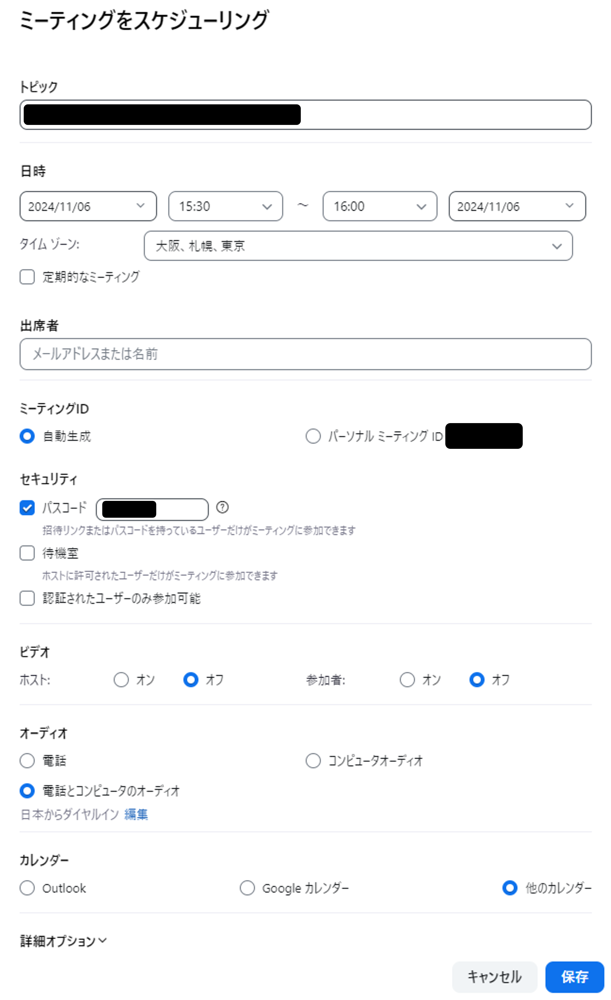{:.border}
4. 右下の「保存」を押してください．ひとつ前の画面で「カレンダー」について「他のカレンダー」を選択している場合，下の画像のような画面が表示されます．「参加Zoomミーティング」の下に記載されているミーティングの URL やミーティングID，パスコードなどを抜き出して，メールなどを用いて参加者に通知してください．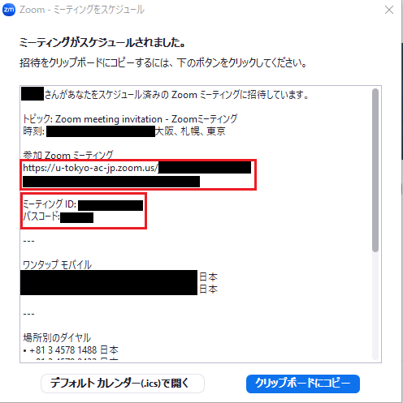{:.border}

### すぐにミーティングを開始する
{:#create-now}  
急な打ち合わせのときなど，即座にミーティングを立ち上げることができます．

1. Zoomのアプリを開いてください．
1. 「新規ミーティング」を押してください．このとき使われるミーティングIDには，ランダムなミーティングID（数字11桁）と，「パーソナルミーティングID（数字10桁）」の2種類があります．デフォルトでは，ランダムなミーティングIDが毎回新たに生成され，ミーティング終了後すぐに無効になります．一方で，パーソナルミーティングIDを利用したい場合は「新規ミーティング」の横にある「∨」を押して「パーソナルミーティングIDを使用」にチェックを入れてください．
  * パーソナルミーティングIDとは，個人用ミーティングとして各ユーザーに固有に割り当てられるミーティングIDのことです．パーソナルミーティングIDを知っている相手とのミーティングでは招待の手間がかからないというメリットがあります．しかしその反面，ミーティングのロックや待機室機能を設定しない場合，他の用途で使用しているときでもパーソナルミーティングIDを知っている人が入室できてしまうため，注意が必要です．
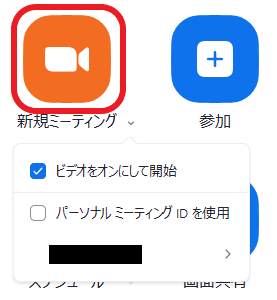{:.border}
3. ミーティングが開始されたら，ミーティング画面の「参加者」の横の「^」を押して，「招待リンクをコピー」するか，ミーティング画面上部の緑色の盾マークから「リンクをコピー」して，参加者に通知してください．
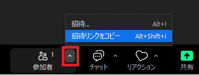{:.border}
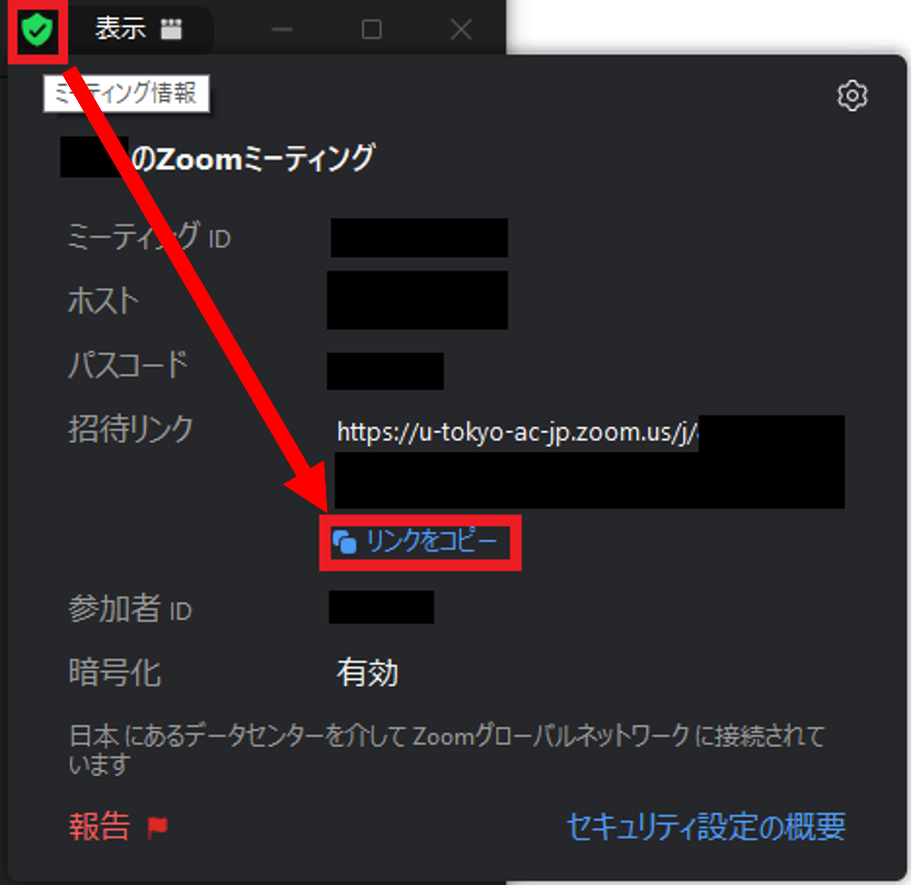{:.border .small}

## アプリ上でのミーティングの確認と編集
{:#manage}  
作成したミーティングはアプリ画面上部の「ミーティング」から確認でき，招待リンクのコピーやミーティングの編集が可能です．
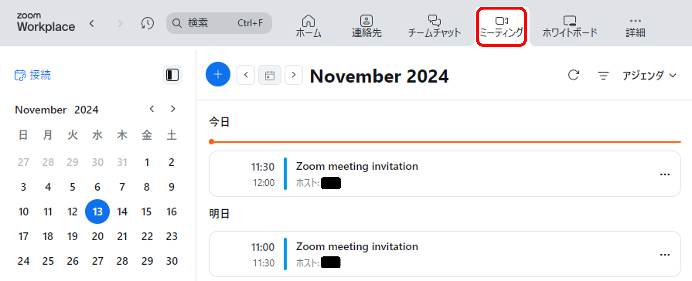{:.border .medium}
ミーティング当日には「ホーム」に下の画像のような表示が出ます．「…」から招待リンクのコピーやミーティングの編集が可能です．
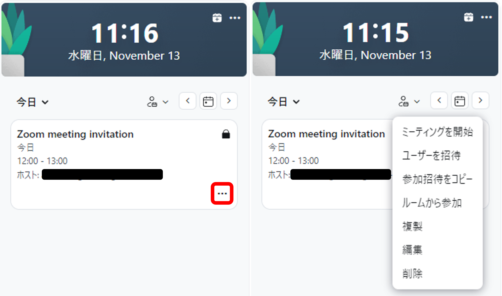{:.border .medium}

## アプリでのおすすめ設定
{:#settings}  
ホーム画面の右上の歯車のアイコンを押すと，アプリの各種設定をできるウィンドウが表示されます．設定しておくと便利な項目をいくつか紹介します．

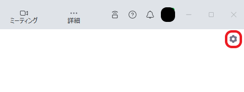{:.border}

### ビデオ
{:#settings-video}  
* **参加時に自分のビデオをオフにする**：チェックを入れると，ミーティングに参加するときに自動的に自分のビデオがオフになります．
* **参加時にビデオプレビューダイアログを常に表示する**：チェックを入れると，ミーティングに参加するときに，ビデオのオンオフや映りを確認できます．

### オーディオ
{:#settings-audio}  
* **参加時にコンピュータでオーディオに自動接続する**：チェックを入れると，下の画像のようなオーディオの選択に関するダイアログを確認するという入室時のひと手間を省くことができます．
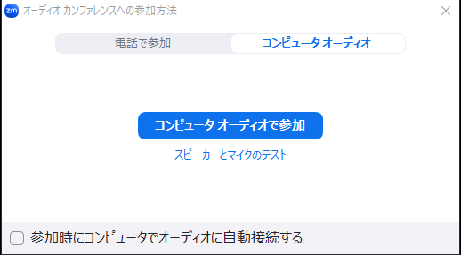{:.border}
* **参加時にマイクをミュート**：チェックを入れると，ミーティングに参加する際に自動的に自分のマイクがオフになります．

## バージョンの更新方法
{:#update}  
Zoomのアプリは定期的に新しいバージョンが提供され，新機能の追加や不具合の修正が行われています．また，特定のバージョンより古いZoomのアプリは利用できなくなることがあります．Zoomのアプリをより安全に，快適に利用するために定期的にアップデートを行ってください．

### 更新手順
{:#update-steps}  
ホーム画面のアイコンから，「更新のチェック」を押してください．すると，最新版かどうかのチェックが始まります．すでに最新版がインストールされている場合「最新の状態を保っています」と表示されます．インストール可能な最新版がある場合は，「新しいバージョンのZoomを利用できます」と表示されます．「今すぐ更新」を押して最新版をインストールしてください．

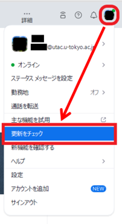{:.border}
{:.border}

また，自動更新の設定をしておくと便利です．ホーム画面右上の歯車のアイコンを押して設定ウィンドウを開き，「一般」の「Zoomデスクトップクライアントを自動更新する」にチェックを入れることで自動更新が有効になります．こうすることで，Zoomの新しいバージョンが利用可能な場合，下の画像のように更新を促すメッセージが表示されます．
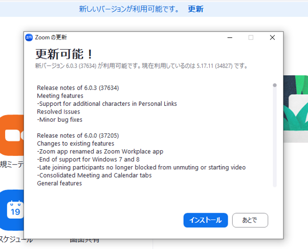{:.border .medium}
メッセージが出たときに「あとで」を押す，またはウィンドウを閉じた場合，次にアプリを起動したときに更新プログラムが自動的にインストールされ，以下のメッセージが表示されます．
{:.border}

## モバイル端末用アプリについて
{:#mobile}  
ここまでデスクトップアプリについて説明してきましたが，ここではモバイルアプリについて説明します．

### インストール方法
{:#mobile-install}  
アプリストアからモバイルアプリ「Zoom Workplace」をダウンロードできます．
1. iOS版は「App Store」を，Andoroid版は「Google Play ストア」を開いてください．
1. 検索窓に「zoom」と入力し検索してください．
1. 「Zoom Workplace」という名前のアプリをダウンロードしてください．Zoomという名前のつく他のアプリや類似の偽アプリが表示される場合もあるため，注意が必要です．

また，公式サイトの「[ダウンロードセンター](https://zoom.us/download)」からアプリストアを開くことができます．公式サイトを経由することで，間違ったアプリをダウンロードすることを防ぐことができます．
{:.border}
アプリを使い始める際にサインインする必要があります．「[Zoomサインイン方法](/zoom/signin/#app)」を参考にして，デスクトップアプリと同様にUTokyo Accountでサインインしてください．

### モバイルアプリとデスクトップアプリの違い
{:#mobile-vs-desktop}  
モバイルアプリとデスクトップアプリの機能の違いのうち，特筆すべきものを挙げておきます．

* **投票機能**（参考ページ：[Zoom投票機能](/zoom/usage/poll/)）：デスクトップアプリではアプリ上で投票/クイズの作成ができますが，事前に投票を作成していない場合，モバイルアプリでは「投票/クイズ」＞「作成」を押すと，ブラウザで投票を作成することになります．
* **ブレイクアウトルーム**（参考ページ：[Zoom ブレークアウトルーム機能を使う](/zoom/usage/breakout/)）：モバイルアプリからブレイクアウトルームを作成することはできません．そのため，ブレイクアウトルームを作成したい場合はデスクトップアプリを利用してください．モバイルアプリからブレイクアウトルームに参加することは可能です．
* **レコーディング機能**（参考ページ：[Zoomのレコーディング機能](/zoom/usage/recording/)）：モバイルアプリではローカルレコーディングはできません．

## 端末の切り替え
{:#device-switch}  
Zoomミーティング参加中に，ミーティングに参加している状態が途切れないまま端末を切り替えることができます．スマホとパソコン，パソコンと別のパソコン，といった端末の切り替えをスムーズに行えます．

### 複数端末でのサインイン
{:#multi-device-signin}  
端末の切り替えを行うには切り替え先のパソコンやスマホなどの端末で，切り替える前の端末と同じアカウントにサインインしている必要があります．最大で5台のコンピューター，5台のスマートフォン，5台のタブレットに同時にサインインすることができます．

### 端末の切り替え手順
{:#device-switch-steps}  
1. ミーティング中に切り替え先の端末でZoomのアプリを立ち上げてください．
1. 画面に表示される「切り替え」のボタンを押してください．切り替える前に使用していた端末の接続は自動的に切れます．
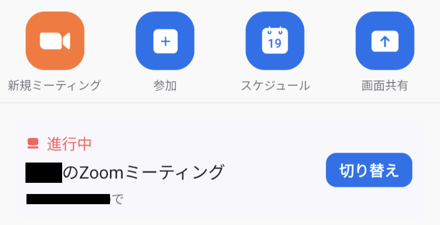{:.border}

端末の切り替え時には以下の機能について注意が必要です．
- チャット機能
  - 端末を切り替える前のチャット内容は引き継がれません．
- レコーディング機能
  - ローカルレコーディングをしている人が端末を切り替えた場合，ローカルレコーディングは停止されます．
